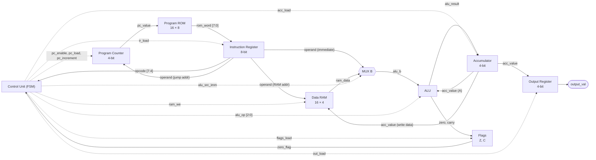
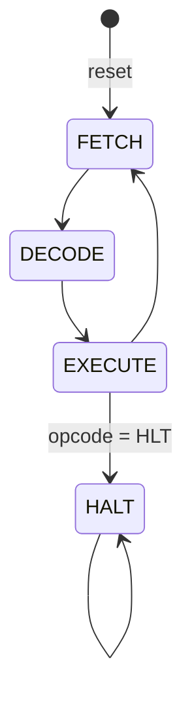

# Tiny4 CPU (( readme not complete :') ))

A complete 4-bit, accumulator-based, multicycle CPU with a custom 8-bit instruction set, designed from scratch in Verilog and running on a **Basys 3 (Artix-7) FPGA**.

<!-- TODO: add a photo or GIF of the board running a program here -->
<!--  -->

---

## Highlights

- **Custom ISA:** 15 instructions (8 bits each) covering arithmetic, bitwise, immediate, load/store, jumps, output, and halt
- **Multicycle design:** every instruction runs through FETCH → DECODE → EXECUTE, sequenced by a control FSM
- **Full datapath:** ALU, accumulator, program counter, instruction register, zero/carry flags, 16 × 8 program ROM, and 16 × 4 data RAM
- **Latch-free control logic:** every control signal has a safe default at the top of the combinational block
- **Verified in simulation:** every module tested individually, then full programs tested end to end in Vivado behavioral simulation
- **Runs on real hardware:** synthesized and deployed on a Basys 3 Artix-7 FPGA, with single-step and slow-run modes that show internal CPU state on LEDs and the seven-segment display

---

## Datapath

Solid arrows carry data. Dotted arrows are control signals from the control unit.



### How the pieces connect

- The **instruction register** splits each 8-bit instruction into a 4-bit **opcode** (bits 7:4), which goes to the control unit, and a 4-bit **operand** (bits 3:0).
- The operand has three jobs: it is the **jump address** for the program counter, the **address** for data RAM, and the **immediate value** for the ALU.
- **MUX B** chooses the ALU's second input: the immediate operand when `alu_src_imm = 1`, or the value read from RAM when `alu_src_imm = 0`.
- The ALU's first input is always the **accumulator**, and its result always goes back into the accumulator. This is what makes Tiny4 an accumulator machine.
- The accumulator also feeds the RAM's write port (for `STA`) and the output register (for `OUT`).

---

## Control FSM

Every instruction takes three clock cycles.



| State | Encoding | What happens |
|-------|----------|--------------|
| FETCH | `00` | `ir_load` copies the instruction at the PC from ROM into the IR, and `pc_increment` moves the PC to the next address |
| DECODE | `01` | The opcode settles and the control unit prepares the signals for EXECUTE |
| EXECUTE | `10` | The instruction runs: ALU result written to the accumulator, RAM written, PC loaded for a jump, or output updated |
| HALT | `11` | `halted` goes high and the CPU stays here until reset |

The state register only advances when `cpu_enable` is high. Holding `cpu_enable` low freezes the CPU in its current state, which is what makes single-step and slow-run modes possible.

---

## Instruction Set

Each instruction is 8 bits:

```
 7   6   5   4   3   2   1   0
[    opcode    ][   operand    ]
```

| Opcode | Mnemonic | Operand | Operation | Updates flags? |
|--------|----------|---------|-----------|----------------|
| `0000` | NOP  | –       | Do nothing | No |
| `0001` | LDI  | imm     | ACC ← imm | Yes |
| `0010` | LDA  | addr    | ACC ← RAM[addr] | Yes |
| `0011` | STA  | addr    | RAM[addr] ← ACC | No |
| `0100` | ADD  | addr    | ACC ← ACC + RAM[addr] | Yes |
| `0101` | SUB  | addr    | ACC ← ACC − RAM[addr] | Yes |
| `0110` | AND  | addr    | ACC ← ACC & RAM[addr] | Yes |
| `0111` | OR   | addr    | ACC ← ACC \| RAM[addr] | Yes |
| `1000` | XOR  | addr    | ACC ← ACC ^ RAM[addr] | Yes |
| `1001` | JMP  | addr    | PC ← addr | No |
| `1010` | JZ   | addr    | If Z = 1, PC ← addr | No |
| `1011` | OUT  | –       | OUT ← ACC | No |
| `1100` | ADDI | imm     | ACC ← ACC + imm | Yes |
| `1101` | NOT  | –       | ACC ← ~ACC | Yes |
| `1110` | –    | –       | Unused (behaves as NOP) | No |
| `1111` | HLT  | –       | Stop the CPU | No |

### ALU operations

| `alu_op` | Operation |
|----------|-----------|
| `000` | A + B |
| `001` | A − B |
| `010` | A & B |
| `011` | A \| B |
| `100` | A ^ B |
| `101` | ~A |
| `110` | Pass B |
| `111` | Default (no instruction uses it) |

### Control signals during EXECUTE

This table shows which control signals each instruction turns on. Anything not listed stays at its safe default (0).

| Instruction | `acc_load` | `alu_src_imm` | `alu_op` | `flags_load` | `ram_we` | `pc_load` | `out_load` |
|-------------|:---:|:---:|:---:|:---:|:---:|:---:|:---:|
| LDI  | 1 | 1 | `110` | 1 | | | |
| LDA  | 1 | 0 | `110` | 1 | | | |
| STA  | | | | | 1 | | |
| ADD  | 1 | 0 | `000` | 1 | | | |
| SUB  | 1 | 0 | `001` | 1 | | | |
| AND  | 1 | 0 | `010` | 1 | | | |
| OR   | 1 | 0 | `011` | 1 | | | |
| XOR  | 1 | 0 | `100` | 1 | | | |
| ADDI | 1 | 1 | `000` | 1 | | | |
| NOT  | 1 | | `101` | 1 | | | |
| JMP  | | | | | | 1 | |
| JZ   | | | | | | 1 if Z | |
| OUT  | | | | | | | 1 |

---

## Example Program

A countdown from 5 to 0 that shows each value on the output, then halts. Subtracting 1 is done with `ADDI 15`, because adding 15 in 4-bit arithmetic wraps around to the same result as subtracting 1.

<!-- TODO: replace with the program actually stored in your ROM if you prefer -->

| Addr | Machine code | Assembly | Meaning |
|------|--------------|----------|---------|
| 0 | `0x15` | `LDI 5`   | ACC = 5 |
| 1 | `0xB0` | `OUT`     | Show ACC |
| 2 | `0xCF` | `ADDI 15` | ACC = ACC − 1 (sets Z when it reaches 0) |
| 3 | `0xA5` | `JZ 5`    | If ACC is 0, jump to 5 |
| 4 | `0x91` | `JMP 1`   | Otherwise loop back |
| 5 | `0xB0` | `OUT`     | Show 0 |
| 6 | `0xF0` | `HLT`     | Stop |

Output sequence: 5, 4, 3, 2, 1, 0.

---

## Module Overview

| Module | Description |
|--------|-------------|
| `tiny4` | CPU core: connects the datapath modules and the control unit, and contains MUX B |
| `control_unit` | FETCH / DECODE / EXECUTE / HALT state machine that drives every control signal |
| `program_counter` | 4-bit PC with increment and load (for jumps) |
| `program_rom` | 16 × 8 instruction memory |
| `instruction_register` | Holds the current instruction |
| `dram` | 16 × 4 data memory |
| `alu` | Arithmetic and logic operations, plus zero and carry outputs |
| `accumulator_register` | The CPU's main working register |
| `flags_register` | Stores the zero and carry flags |
| `output_register` | Holds the value shown on the board |

<!-- TODO: add your Basys 3 top-level wrapper and seven-segment driver module names -->

---

## Board Controls

<!-- TODO: fill in your actual pin/button mapping -->

| Control | Function |
|---------|----------|
| TODO | Reset |
| TODO | Single-step (pulses `cpu_enable` for one clock) |
| TODO | Slow-run mode |
| LEDs | TODO |
| Seven-segment | TODO |

---

## How to Run It

### Requirements
- Xilinx Vivado
- Digilent Basys 3 board (Artix-7 XC7A35T)

### Simulate
1. Clone this repo and open `tiny4_cpu_ews.xpr` in Vivado.
2. In the Flow Navigator, click **Run Simulation → Run Behavioral Simulation**.
3. Add `pc_value`, `ir_word`, `acc_value`, `state`, and `zero_flag` to the waveform to watch each instruction execute.

### Run on the FPGA
1. Click **Run Synthesis**, then **Run Implementation**, then **Generate Bitstream**.
2. Connect the Basys 3 over USB and open the **Hardware Manager**.
3. Click **Open Target → Auto Connect**, then **Program Device**.
4. Use single-step mode to walk through the program one cycle at a time.

---

## Verification

- Each module (ALU, registers, memories, control unit) was tested on its own in simulation before integration.
- Full programs were then simulated end to end, checking behavior across fetch, decode, execute, and memory operations.
- On hardware, single-step mode made it possible to compare the board's state against the simulation cycle by cycle.

<!-- TODO: add a screenshot of a simulation waveform, e.g. docs/waveform.png -->

---

## Future Work

- **Use the carry flag:** the carry flag is stored but no instruction reads it yet. The unused opcode `1110` could become `JC` (jump if carry), enabling multi-word arithmetic.
- **Pipelining:** the DECODE cycle does no work, so overlapping fetch and execute could bring most instructions closer to one cycle each.
- **Larger address space:** a 4-bit PC limits programs to 16 instructions.

---

## What I Learned
This project was extremely beneficial to developing my understanding of Computer Architecture and the RTL behind processors. To challenge myself and my pre-existing understanding of how a CPU works (from ECE 120), I decided to limit myself to only 4 bits. Designing my own ISA with these constraints showed me that every hardware decision has a trade-off between flexibility and simplicity. Choosing an accumulator architecture kept the datapath small but meant more instructions per task. Debugging across fetch, decode, and execute also taught me how much a clean control FSM and good 
visibility into internal state (single-step mode) speed up hardware debugging. 

Most importantly, I learned about my love for Hardware programming. Being able to become so intimate with every single individual bit inside of my 
program is extremely rewarding, and it allows for a lot of freedom in my design. I plan on taking my knowledge beyond small scale projects and one day contributing to something bigger and more meaningful, and also learning more about the full ASIC design flow.

---

## Author

**Swarit Tumuluri**, Computer Engineering, University of Illinois Urbana-Champaign
[LinkedIn](https://linkedin.com/in/swarit-t-3822b12a7)
