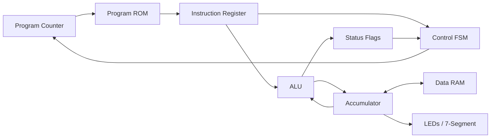

# Tiny4 CPU

A complete 4-bit, accumulator-based, multicycle CPU with a custom 8-bit instruction set, designed from scratch in Verilog and running on a **Basys 3 
(Artix-7) FPGA**.

<!-- TODO: add a photo or GIF of the board running a program here -->
<!--  -->

---

## Highlights

- **Custom ISA:** 8-bit instructions covering arithmetic, bitwise, immediate, load/store, branch, output, and halt operations
- **Multicycle design:** fetch → decode → execute → memory, sequenced by a control FSM
- **Full datapath:** ALU, accumulator, program counter, instruction register, status flags, program ROM, and data RAM
- **Verified in simulation:** every module tested individually, then full programs tested end to end in Vivado behavioral simulation
- **Runs on real hardware:** synthesized and deployed on a Basys 3 Artix-7 FPGA
- **Built-in debugging:** manual single-step and slow-run modes, with internal CPU state shown on LEDs and the seven-segment display

---

## Architecture



Tiny4 is an **accumulator machine**: almost every instruction reads from or writes to a single 4-bit accumulator register. This keeps the datapath 
small and each instruction simple.

### Control FSM

Each instruction takes several clock cycles. The control unit steps through these states:

| State   | What happens |
|---------|--------------|
| FETCH   | Read the instruction at the program counter's address from ROM into the instruction register |
| DECODE  | Split the instruction into opcode and operand, and choose the control signals |
| EXECUTE | Run the ALU operation, update the accumulator and flags, or compute a branch target |
| MEMORY  | Load from or store to data RAM (load/store instructions only) |
| HALT    | Stop the CPU until reset |

<!-- TODO: check these state names match your Verilog and add/remove states as needed -->

---

## Instruction Set

<!-- TODO: fill in with your real opcodes. Format below assumes 4-bit opcode + 4-bit operand; change if yours differs. -->

Each instruction is 8 bits:

```
 7   6   5   4   3   2   1   0
[   opcode    ][   operand    ]
```

| Opcode | Mnemonic | Operation | Flags affected |
|--------|----------|-----------|----------------|
| `0000` | TODO | TODO | TODO |
| `0001` | TODO | TODO | TODO |
| ...    | ...  | ...  | ...  |

Instruction categories: arithmetic, bitwise, immediate, load/store, branching, output, halt.

---

## Module Overview

<!-- TODO: replace with your actual file/module names -->

| Module | Description |
|--------|-------------|
| `top.v` | Top-level module that connects the CPU to Basys 3 switches, buttons, LEDs, and display |
| `cpu.v` | Connects the datapath and control unit |
| `control_fsm.v` | Fetch-decode-execute state machine |
| `alu.v` | Arithmetic and bitwise operations, flag generation |
| `program_rom.v` | Holds the program being run |
| `data_ram.v` | Read/write data memory |
| `seven_seg.v` | Drives the seven-segment display |

---

## Board Controls

<!-- TODO: fill in your actual pin/button mapping -->

| Control | Function |
|---------|----------|
| TODO (e.g. BTNC) | Reset |
| TODO | Single-step one clock cycle |
| TODO (switch) | Toggle slow-run mode |
| LEDs | TODO (e.g. program counter, current FSM state) |
| Seven-segment | TODO (e.g. accumulator value, output register) |

---

## Example Program

<!-- TODO: add a short program you ran, with what it does and what you saw on the board -->

```
; Example: TODO
```

---

## How to Run It

### Requirements
- Xilinx Vivado
- Digilent Basys 3 board (Artix-7 XC7A35T)

### Simulate
1. Clone this repo and open `tiny4_cpu_ews.xpr` in Vivado.
2. In the Flow Navigator, click **Run Simulation → Run Behavioral Simulation**.
3. Watch the program counter, accumulator, and FSM state in the waveform viewer.

### Run on the FPGA
1. Click **Run Synthesis**, then **Run Implementation**, then **Generate Bitstream**.
2. Connect the Basys 3 over USB and open the **Hardware Manager**.
3. Click **Open Target → Auto Connect**, then **Program Device**.
4. Use single-step mode to walk through the program one cycle at a time.

---

## Verification

- Each module (ALU, register file, memories, control FSM) was tested on its own in simulation before integration.
- Full programs were then simulated end to end, checking the processor's behavior during fetch, decode, execute, and memory operations.
- On hardware, single-step mode made it possible to compare the board's state against the simulation cycle by cycle.

<!-- TODO: add a screenshot of a simulation waveform, e.g. docs/waveform.png -->

---

## What I Learned

This project was extremely beneficial to developing my understanding of Computer Architecture and the RTL behind processors. To challenge myself and my
pre-existing understanding of how a CPU works (from ECE 120), I decided to limit myself to only 4 bits. Designing my own ISA with these constraints 
showed me that every hardware decision has a trade-off between flexibility and simplicity. Choosing an accumulator architecture kept the datapath 
small but meant more instructions per task. Debugging across fetch, decode, and execute also taught me how much a clean control FSM and good 
visibility into internal state (single-step mode) speed up hardware debugging. 

Most importantly, I learned about my love for Hardware programming. Being able to become so intimate with every single individual bit inside of my 
program is extremely rewarding, and it allows for a lot of freedom in my design. I plan on taking my knowledge beyond small scale projects and one day 
contributing to something bigger and more meaningful, and also learning more about the full ASIC design flow.

---

## Author

**Swarit Tumuluri**, Computer Engineering, University of Illinois Urbana-Champaign
[LinkedIn](https://linkedin.com/in/swarit-t-3822b12a7)
